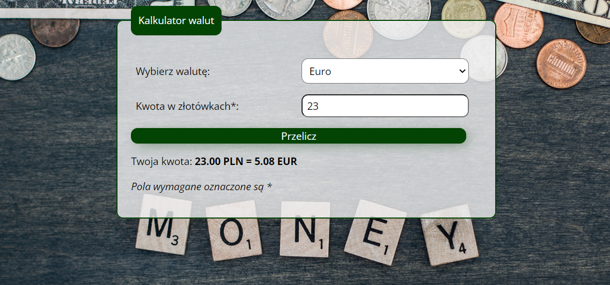

# Currency-Converter 

## Description
First you need to choose the currency and then fill up the form with your amount of polish zloty and push the button. 
Then the simple currency converter count the amount for you, and you will know how much money you should get in chosen currency.

## Demo
My simple currency converter is available online. You can check it here: https://kingagrelewicz.github.io/Currency-Converter/

## Technology
During creating the website I was using Visual Studio Code and I used a BEM convention, ES6+ Features.
The website is built using HTML, CSS, and JavaScript. The website was created to response correctly on desktop, tablets, and mobile devices. 
I used fonts available on Google Fonts, Sharing debugger and flexbox convention.
